# Interactive Theorem Proving Project, EPFL, Spring 2024

*Matt Bovel, Samuel Chassot*


## Representation

```scala
// 1. Map from each element to its parent
class DisjointSet[A](val parents: Map[A, A] = Map.empty[A, A])

// 2. Map from each element to its equivalence class
class DisjointSet[A](val equivalences: Map[A, List[A]])

// 3. List of list where each list is an equivalence class
class DisjointSet[A](val classes: List[List[A]])

// 4. Map from each element to its representative directly
// c.f. flat representation
class DisjointSet[A](val parents: Map[A, A] = Map.empty[A, A])
```

We implemented 1., 2. and 4. in Scala.

In Coq, we tried 3. first, but it was too cumbersome to work with. We then switched to 4. and it is still cumbersome.

## Coq structure

Equality axiomatisation:

https://github.com/mbovel/itp-project/blob/7bc0a61bfe645bbe60b34dbe0152f6850ac5f708/src/Equivalence.v#L5-L9

Tried with types classes first:

https://github.com/mbovel/itp-project/blob/d738ba3a33debc28b965aa1278d682d609a33de3/src/DisjointSet.v#L8-L58

Then came back to modules:

https://github.com/mbovel/itp-project/blob/0345f50283ee9a9fe85e6d399b44540ea1361887/src/DisjointSet.v#L10-L35

## Main theorem

```mermaid
graph TD

  %% Define the nodes
  A[BOOL_EQ]
  B[DISJOINT_SET]
  C[StringBoolEq]
  D[DisjointSetListList]
  E[DisjointSetListPair]
  F[beq_correct]
  G[make_graph]
  H[make_correct]
  I[union]
  J[equiv]
  K[get]
  L[is_map]
  M[get_in]
  N[beq_refl]
  O[in_get]
  P[list_beq]
  Q[replace_values]
  R[repr]
  S[ensure_repr]
  T[ensure_repr_exists]
  U[repr_head]
  V[ensure_repr_mono]
  W[ensure_repr_mono_none]
  X[ensure_repr_preserve]
  Y[ensure_repr_get]
  Z[ensure_repr_get_2]
  AA[union_different_same_repr]
  AB[replace_values_correct]
  AC[replace_values_correct_neq]
  AD[replace_values_correct_neq_none]
  AE[union_correct_1]
  AF[union_correct]
  AG[union_mono]
  AH[union_repr_1]
  AI[union_repr_2]
  AJ[union_repr_3]
  AK[make_correct_left]
  AL[make_correct_right]
  
  %% Define the edges
  B --> A
  C --> A
  D --> B
  E --> B
  H --> F
  H --> G
  H --> J
  H --> I
  I --> Q
  I --> R
  J --> R
  M --> K
  O --> L
  O --> K
  V --> S
  W --> S
  X --> S
  Y --> S
  Z --> S
  AA --> I
  AE --> I
  AF --> I
  AG --> I
  AH --> I
  AI --> I
  AJ --> I
  AK --> J
  AL --> J
  AD --> Q
  AB --> Q
  AC --> Q

  K --> R
  M --> R
  N --> R
  P --> R

  Q --> AB
  Q --> AC
  Q --> AD

  S --> T
  S --> U
  S --> V
  S --> W
  S --> X
  S --> Y
  S --> Z

  %% Labels for the primary components
  subgraph "BOOL_EQ Module"
    A
    C
  end

  subgraph "DISJOINT_SET Module"
    B
    D
    E
  end

  subgraph "StringBoolEq"
    C
  end

  subgraph "DisjointSetListList"
    D
    P
  end

  subgraph "DisjointSetListPair"
    E
    F
    G
    H
    I
    J
    K
    L
    M
    N
    O
    Q
    R
    S
    T
    U
    V
    W
    X
    Y
    Z
    AA
    AB
    AC
    AD
    AE
    AF
    AG
    AH
    AI
    AJ
    AK
    AL
  end
```


