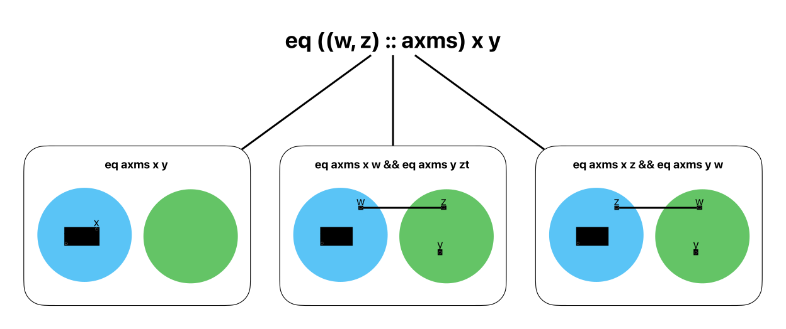

# Interactive Theorem Proving Project, EPFL, Spring 2024

*Matt Bovel, Samuel Chassot*

## Abstract

We implement a simple disjoint-set data structure that directly maps each element to its representative in Coq. We then verify that this data structure can be used to decide if a pair of elements are equivalent with respect to the equivalence relation derived from a finite set of base axioms.

Code: https://github.com/mbovel/itp-project.

## Motivation

Deciding the equivalence of two elements is useful in many applications such as type systems, SMT solvers, and verification.

As a simple example from software verification, one might want to verify that `x` and `z` are always in the then-branch of the following code:

```scala
if x == y && y == z then
  assert(x == z) // Verify that this always holds
```

## Background

Let $R \subseteq A \times A$ be a binary relation.

We define $rst(R)$ its *reflexive-symmetric-transitive closure*—or *equivalence closure*—as the smallest relation such that:

- Axioms: $R \subseteq rst(R)$
- Reflexivity: $\forall a. \; (a, a) \in rst(R)$
- Symmetry: $\forall a, b. \; (a, b) \in rst(R) \Rightarrow (b, a) \in rst(R)$
- Transitivity: $\forall a, b, c. \;\left((a, b) \in rst(R) \land (b, c) \in rst(R) \right) \Rightarrow (a, c) \in rst(R)$

The [*Union-Find*](https://en.wikipedia.org/wiki/Disjoint-set_data_structure) data structure can be used to efficiently compute this closure. It manages a partition of elements into disjoint sets, supporting efficient union and find operations allowing to query the equivalence classes.

## Specification

We start with an inductive definition of equivalence parametrized by a relation `R` represented as a `list (A * A)` of pairs of elements of type `A`:

```coq
Inductive eq {A : Type} (axms : list (A * A)) : A -> A -> Prop :=
  | eq_axms: forall x y: A, In (x, y) axms -> eq axms x y
  | eq_refl: forall x: A, eq axms x x
  | eq_sym: forall x y: A, eq axms y x -> eq axms x y
  | eq_trans: forall x y z: A, eq axms x y -> eq axms y z -> eq axms x z.
```

This definition represents the reflexive-symmetric-transitive closure (or equivalence closure) of the relation `R`. This gives the smallest equivalence relation that contains `R`.

This inductive definition is used as a specification for the equivalence relation data structure that we implement.

## Implementation

### Scala candidates

We explored three different implementations of equivalence closure in Scala before implementing them in Coq. We present them here for reference:

1. Map from each element to its parent, corresponding to union-find data structure without rank or path compression:

    ```scala
    final class DisjointSet[A](val parents: Map[A, A] = Map.empty[A, A]):
      @tailrec def repr(a: A): A =
        val parent = parents.getOrElse(a, a)
        if parent == a then a else repr(parent)

      def equiv(a: A, b: A): Boolean =
        repr(a) == repr(b)

      def union(a: A, b: A): DisjointSet[A] =
        val aRepr = repr(a)
        val bRepr = repr(b)
        DisjointSet(parents + (bRepr -> aRepr))
    ```

    In this version, the representative of an element is either itself if its parent is itself, or the representative of its parent. If the element is not in the map, it is its own representative.

    Two elements are equivalent if their representatives are the same.

    Inserting a new equivalence between two elements `a` and `b` in the relation is done by adding a new pair to the map, mapping the parent of `b` to the parent of `a`.

2. Map from each element to its equivalence class.

    ```scala
    final class DisjointSet[A](val equivalences: Map[A, List[A]] = Map.empty[A, List[A]]):
      def repr(a: A): A =
        getEquivs(a).head

      def equiv(a: A, b: A): Boolean =
        repr(a) == repr(b)

      private def getEquivs(a: A): List[A] =
        equivalences.getOrElse(a, List(a))

      def union(a: A, b: A): DisjointSet[A] =
        val newClass = getEquivs(a) ++ getEquivs(b)
        DisjointSet(equivalences ++ newClass.map(_ -> newClass))
    ```

    In this version, the representative of an element is the representative of its equivalence class, which is the first element of the list representing the classes. If the element is not in the map, it is its own representative.

    Two elements are equivalent if their representatives are the same.

    Inserting a new equivalence between two elements `a` and `b` in the relation is done by creating a new list for the new class, which is the concatenation of the lists of the classes of `a` and `b`. Then, the map is updated to map all elements of the new class to this list.

3. List of list where each list is an equivalence class.

    ```scala
    final case class DisjointSet[A](val classes: List[List[A]]):
      def union(a: A, b: A): DisjointSet[A] =
        val aClass = findEqClass(a).getOrElse(List(a))
        val bClass = findEqClass(b).getOrElse(List(b))
        if aClass == bClass then DisjointSet(classes)
        else
          val newClasses = (aClass ++ bClass) :: classes.filterNot(c => c == aClass || c == bClass)
          DisjointSet(newClasses)

      def repr(a: A): A =
        findEqClass(a).getOrElse(List(a)).head

      private def findEqClass(a: A): Option[List[A]] =
        classes.find(_.contains(a))

      def equiv(a: A, b: A): Boolean =
        repr(a) == repr(b)
    ```

    In this version, the representative of an element is the first element of the list (i.e. class) containing this element. If no class contains the element, the element is its own representative.

    Two elements are equivalent if their representatives are the same.

    Inserting a new equivalence between two elements `a` and `b` in the relation is done by first checking whether the two classes are in fact the same class: if that is the case, the structure is left unchanged; otherwise, a new class is created by concatenating the two classes and removing the old classes from the list of classes.

4. List of pairs, effectively mapping each element to its representative.

    ```scala
    final case class DisjointSet[A](val classes: List[(A, A)]):
      def repr(a: A): A =
        classes.find(p => p._1 == a) match
          case None         => a
          case Some((_, r)) => r

      def equiv(a: A, b: A): Boolean =
        repr(a) == repr(b)

      def union(a: A, b: A): DisjointSet[A] =
        val aRepr = repr(a)
        val bRepr = repr(b)
        val gPrime = ensureRepr(ensureRepr(classes, aRepr), bRepr)
        DisjointSet(gPrime.map(p => if p._2 == bRepr then (p._1, aRepr) else p))
      
    def ensureRepr[A](classes: List[(A, A)], a: A): List[(A, A)] =
      classes.find(p => p._1 == a) match
        case None    => (a, a) :: classes
        case Some(_) => classes
    ```

    In this version, the representative of an element is the second element of the pair containing this element. If no pair contains the element, the element is its own representative.

    Two elements are equivalent if their representatives are the same.

    Inserting a new equivalence between two elements `a` and `b` in the relation is done by first finding the representatives of `a` and `b`, then ensuring that they are in the list of pairs. Finally, the list of pairs is updated to change the representative of all elements that had the same representative as `b` to the have the representative of `a` instead.

    It is interesting to note that this version is similar to the version 1, but differs in the way that finding the representative is now a constant time operation, that is not defined recursively. The cost is transferred to the `union` operation that now needs to update all pairs that have the same representative as `b`, i.e., elements that are members the classes of equivalence of `b`.

### Coq implementation

#### Interface

We first define a Coq `Module` representing the disjoint-set interface:

```coq
Module Type DISJOINT_SET (Import BE : BOOL_EQ).
  Parameter D : Type.
  Parameter empty : D.
  Parameter union : D -> A -> A -> D.
  Parameter equiv : D -> A -> A -> bool.
  Fixpoint make_graph (axms: list (A * A)) : D :=
    match axms with
    | [] => empty
    | (x, y)::axms' => union (make_graph axms') x y
    end.
  Axiom make_correct: forall axms x y,
    eq axms x y <-> equiv (make_graph axms) x y = true.
End DISJOINT_SET.
```

This module defines a type `D` for the disjoint-set data structure that represents the equivalence closure of an underlying implicit relation `R`, an empty disjoint-set `empty`, a union operation `union` that adds a new pair `(a, b)` to the relation `R`, and an equivalence check `equiv`. The `make_graph` function builds a disjoint-set data structure from a list of pairs of elements. The `make_correct` axiom states that the equivalence relation represented by the disjoint-set data structure is equivalent to the equivalence closure of the relation `R` represented by the list of pairs. This `make_correct` axiom is the main theorem to prove in the project.

This disjoint-set interface is generic in the type of elements it contains. An implementation of `BOOL_EQ` for that type is required to be able to use the data structure. The `BOOL_EQ` module provides a boolean equality function for the type `A`, along with a proof that this boolean equality is equivalent to the structural equality used by Coq:

```coq
Module Type BOOL_EQ.
  Parameter A : Type.
  Axiom eq_dec : forall (x y : A), {x = y} + {x <> y}.
  Parameter beq : A -> A -> bool.
  Notation "x =? y" := (beq x y) (at level 70).
  Axiom beq_correct : forall x y : A, (x =? y) = true <-> x = y.
End BOOL_EQ.
```

Here is a simple implementation of `BOOL_EQ` for the `string` type as an example:

```coq
Module StringBoolEq <: BOOL_EQ.
  Definition A := string.
  Definition eq_dec := String.string_dec.
  Definition beq := String.eqb.
  Definition beq_correct := String.eqb_eq.
End StringBoolEq.
```

#### Implementation as a list of pairs

We implemented the fourth representation described by the Scala candidates in Coq, i.e., the implementation based on a list of pairs mapping each element to its representative. We used this particular representation as it was the most practical to work with, while remaining an efficient implementation. In the Coq implementation, the list of pairs is contrained to be a map, i.e., a list of pairs `(A * A)` with no two pairs with the same first element.

We implemented it as of as another `Module` in Coq, implementing the interface described above:

```coq
Module DisjointSetListPair (Import BE : BOOL_EQ) <: DISJOINT_SET BE.
  Definition D := list (A * A).
  Definition empty : D := [].
```

The `replace_values` function implements the `map` application in the Scala implementation, replacing all values `v1` by `v2` appearing in the second position of a pair in the list:

```coq
Fixpoint replace_values (ds: D) (v1 v2: A) : D :=
    match ds with
    | [] => []
    | (x, y)::ds' => (x, if y =? v1 then v2 else y) :: replace_values ds' v1 v2
    end.
```

We use this custom implementation instead of a call to `map` for better control over the function and the proof that work with and on it.

We then define the `repr` function returning the representative of an element in the disjoint-set data structure and the `ensure_repr` function that ensures that an element is in the disjoint-set data structure, i.e., the list contains a pair with the element as the first element:

```coq
Definition repr (ds: D) (x: A) : A :=
  match get ds x with
  | Some y => y
  | None => x
  end.

Definition ensure_repr (ds: D) (x: A) : D :=
  match get ds x with
  | Some _ => ds
  | None => (x, x) :: ds
  end.
```

We then can implement the `equiv` function that checks whether two elements are equivalent in the disjoint-set data structure:

```coq
Definition equiv (ds: D) (x y: A) : bool :=
  (repr ds x) =? (repr ds y).
```

The `union` function is implemented as in the Scala version, but with the `replace_values` function instead of a call to `map`:

```coq
Definition union (ds: D) (x y: A) : D :=
  let xr := (repr ds x) in
  let yr := (repr ds y) in
  let ds' := (ensure_repr (ensure_repr ds xr) yr) in
  (replace_values ds' yr xr).
```

Finally, we define the `make_graph` function that builds a disjoint-set data structure from a list of pairs of elements:

```coq
Fixpoint make_graph (axms: list (A * A)) : D :=
  match axms with
  | [] => empty
  | (x, y)::axms' => union (make_graph axms') x y
  end.
```

`make_graph` calls `union` for each pair in the list of pairs, building the disjoint-set data structure incrementally.

### Runtime complexity analysis

We analyse briefly the difference in runtime complexity of the algorithms implemented by the disjoint-set data structure:

- Equivalence check: the worst case is `O(N)` where `N` is the number of pairs in the list, as we need to traverse the list to find the representative of each element. This could go down to `O(1)` with a smarter implementation of the map structure. The linear cost comes from the representation as a list rather than being inherent to the algorithm.
- Union: the worst case is `O(N)` where `N` is the number of pairs in the list, as we need to traverse the list to find the representative of each element. This could go down to `O(M)` where `M` is the size of the largest equivalence class, with a smarter implementation of the map structure. Indeed, when adding a new axiom `(w, z)`, the representative of all elements in the class of `z` need to be updated to the representative of `w`.

## Proof of correctness

As stated in the previous section, the main theorem to prove is the following:

```coq
Axiom make_correct: forall axms x y,
    eq axms x y <-> equiv (make_graph axms) x y = true.
```

which states that two elements are equivalent according to the disjoint-set structure for the relation `R` if and only if they are equivalent according in the equivalence closure of `R`. `R` is represented by a list of axioms `axms`. This list is a list of pairs `(x, y)`, meaning that `x` and `y` are equivalent in the relation `R`.

The proof of this theorem is done by induction on the list of axioms `axms`. The base case is trivial, as the empty list of axioms corresponds to the empty relation, and the disjoint-set data structure built from it is also empty, implying that no different elements are equivalent.

For the inductive case however, we need a way to reason about the equivalence of two elements `x` and `y` in the disjoint-set data structure built from a list of axioms with an additional axiom `(w, z)`. Exposed differently, we need to reason about what happens when we add an axiom `(w, z)` to a list of axioms `axms` and build the disjoint-set data structure from it. 

Formally, this boils down to analysing what `eq (w, z) :: axms x y` means with respect to `eq axms x y`. This is one of the pivotal lemmas of the proof.

The lemma is the following:

```coq
  (
     (eq axms x y)
     \/ (eq axms x z /\ eq axms y w)
     \/ (eq axms x w /\ eq axms y z)
  )
    <-> eq ((z, w) :: axms) x y.
```

A careful case analysis shows that there are three cases to consider, that we will explain with the help of a diagram:



Let us detail the three cases:

1. `x` and `y` are already equivalent in the relation `R` represented by `axms`. In this case, adding the axiom `(z, w)` does not change the equivalence of `x` and `y` in the relation `R` represented by `(z, w) :: axms`.

2. `x` and `y` are in two different classes in the relation `R` represented by `axms`, and adding a new axiom `(w, z)` acutally merges the two classes, because `w` is in the same class as `x` and `z` is in the same class as `y`.

3. This is the same situation as 2., but with `w` and `z` swapped. This case is symmetric to the previous one.

These are the three possible cases leading to `x` and `y` being equivalent under the relation `R` represented by `(z, w) :: axms`. We use this case analysis to prove the inductive case of our proof by induction on the list of axioms.

### From theory to practice

In this direction, we need to prove that if two elements are equivalent with respect to the equivalence closure of a list of axioms, then they are equivalent in the disjoint-set data structure built from this list of axioms. This is the `make_correct_left` lemma.

To prove it, we proceed by induction on the list of axioms. The base case is trivial. For the inductive case, we use the main lemma described above to reason about the equivalence of two elements `x` and `y` in the disjoint-set data structure built from a list of axioms with an additional axiom `(w, z)`.

```coq
Lemma make_correct_left: forall axms x y,
  eq axms x y -> equiv (make_graph axms) x y = true.
Proof.
  induction axms; intros.
  - ...
  - destruct a as [z w].
    (* IH: forall x y : A, eq axms x y -> equiv (make_graph axms) x y = true *)
    (* H: eq ((z, w) :: axms) x y *)
    (* Goal: equiv (make_graph ((z, w) :: axms)) x y = true *)
    apply eq_nonempty_inverse in H.
    (* Prove the 3 cases using union_correct and union_mono *)
```

To prove these three cases, we use the `union_correct` and `union_mono` lemmas.

The `union_mono` lemma states that if two elements are equivalent in a liste `ds`, then they stay equivalent in the list `union ds w z`, for any `w` and `z`. Said otherwise, adding an equivalence cannot split existing equivalence classes, but only merge them—union is monotonic with respect to equivalence.

To prove this lemma, we distinguish two cases: either the representatives of `x` and `z` are the same in `ds`, in which case both `x` and `y` will have the same representative in `union ds w z`, or they are different, in which case the representatives of `x` and `y` will not change in `union ds w z`.

```coq
Lemma union_mono: forall ds x y w z,
  equiv ds x y = true -> equiv (union ds w z) x y = true.
Proof.
  intros. 
  unfold equiv in *.
  destruct ((repr ds x) =? (repr ds z)) eqn:Heq; beq_to_eq.
  + (* In this case, the representatives of x and y will change to become (repr w) *)
    ...
  + (* In this case, the representatives of x and y will not change *)
    ...
```

The `union_correct` lemma intuitively states that `union` indeed merges the equivalence classes of two elements `w` and `z`. If `x` and `y` are respectively equivalent to `w` and `z` in the structure `ds`, then `x` and `y` will be equivalent in the structure `union ds w z`.

```coq
Theorem union_correct: forall ds w x z y,
  (equiv ds w x = true) -> (equiv ds z y = true) ->
  (equiv (union ds w z) x y = true).
Proof.
  intros. unfold union. unfold equiv in H, H0. beq_to_eq.
  name_term (ensure_repr (ensure_repr ds (repr ds w)) (repr ds z)) ds'.
  assert (get ds' x = Some (repr ds w)). { eauto using ensure_repr_get, ensure_repr_mono. }
  assert (get ds' y = Some (repr ds z)). { eauto using ensure_repr_get, ensure_repr_preserve. }
  apply union_correct_1; assumption.
Qed.
```

Note how we named the result of the `ensure_repr` function `ds'`, and then used small intermediate lemmas to prove that the representatives of `x` and `y` in `ds'` are defined as expected.

```coq
Lemma union_correct_1: forall ds x xr y yr,
  (get ds x) = Some xr -> (get ds y) = Some yr ->
  (equiv (replace_values ds yr xr) x y = true).
```

#### Alternative proof by induction on the hypothesis

An alternative proof of the `make_correct_left` lemma is to proceed by induction on the hypothesis `eq axms x y`. This avoids the use of the `eq_nonempty_inverse` lemma:

```coq
Lemma make_correct_left': forall axms x y,
  eq axms x y -> equiv (make_graph axms) x y = true.
Proof.
  intros.
  induction H.
  1: apply make_graph_in. assumption.
  all: unfold equiv in *; beq_to_eq; congruence.
Qed.
```

The `make_graph_in` lemma states that if two elements are in the list of axioms `axms`, then they are equivalent in the disjoint-set data structure built from this list. To prove it, we still need to proceed by induction on the list of axioms:

```coq
Lemma make_graph_in: forall axms x y,
  In (x, y) axms -> equiv (make_graph axms) x y = true.
Proof.
  intros.
  induction axms.
  - contradiction.
  - destruct H.
    + subst. simpl. apply union_correct; apply equiv_refl.
    + destruct a as [z w]. simpl. apply union_mono, IHaxms. assumption.
Qed.
```

Note that this version also uses the `union_correct` and `union_mono` lemmas to prove the inductive case.

### From practice to theory

The other direction of the proof is to prove that if two elements are equivalent in the disjoint-set data structure built from a list of axioms, then they are equivalent in the equivalence closure of this list of axioms. This is the `make_correct_right` lemma.

To prove it, we proceed by induction on the list of axioms. For the inductive case, we consider 4 cases depending on whether `x` is equivalent to `w` and `y` is equivalent to `w` in `ds`, allowing to come back to one of the 3 possible cases given by lemma `eq_nonempty`.

```coq
Theorem make_correct_right: forall axms x y,
  equiv (make_graph axms) x y = true -> eq axms x y.
Proof.
  induction axms; intros.
  - ...
  - destruct a as [z w]. simpl in H. remember (make_graph axms) as ds.
    (* IH: forall x y : A, equiv ds x y = true -> eq axms x y *)
    (* H : equiv (union ds z w) x y = true *)
    (* Goal: eq ((z, w) :: axms) x y *)
    apply eq_nonempty.
    ...
    destruct (equiv ds x w) eqn:Hxw, (equiv ds y w) eqn:Hyw; unfold equiv in *; beq_to_eq.
    * (* x and y are already equivalent in ds *)
    * (* repr of x change, repr of y stays the same *)
    * (* repr of x stays the same, repr of y change *)
    * (* repr of x was not w and repr of y was not w *)
Qed.
```

In order to prove the 4 cases, we use the `union_repr_change` and `union_different_same_repr` intermediate lemmas.

```coq
Lemma union_repr_change: forall ds x w z,
  repr ds x  = repr ds w -> repr (union ds z w) x = repr ds z.
```

```coq
Lemma union_different_same_repr: forall ds x w z,
  repr ds x <> repr ds w -> repr (union ds z w) x = repr ds x.
```

## Implementation choices

### Modules vs Type Classes

Before deciding to use modules, we considered using type classes to model our structure, and tried the following: 

```coq
Class BoolEq A := {
  beq : A -> A -> bool;
  beq_correct : forall x y : A, beq x y = true <-> x = y
}.

Notation "x =? y" := (beq x y) (at level 70).

Instance string_BoolEq : BoolEq string := {
  beq := String.eqb;
  beq_correct := String.eqb_eq
}.

Record list_disjoint_set {A} {ev: BoolEq A} := {
    elems: list (list A)
  }.

Class DisjointSet D {A} {ev: BoolEq A} := {  
  empty : D;
  union : D -> A -> A -> D;
  equiv : D -> A -> A -> bool;
}.

Definition contains {A} {ev: BoolEq A} (l: list A) (x: A)  : bool :=
  match (List.find (fun y => y =? x) l) with
  | Some _ => true
  | None => false
  end.

Instance list_disjoint_set_DisjointSet A {ev: BoolEq A} : DisjointSet list_disjoint_set := {
  empty := {| elems := [] |};
  union (ds: list_disjoint_set) x y := 
    let (elems) := ds in
    let lx := List.find (fun l => contains l x) elems in
    let ly := List.find (fun l => contains l y) elems in
    match lx, ly with
    | Some lx, Some ly => 
      let elems' := List.filter (fun l => (negb (l =? lx)) && (negb (l =? ly))) elems in
      {| elems := (lx ++ ly) :: elems' |}
    | Some lx, None => {| elems := lx :: elems |}
    | None, Some ly => {| elems := ly :: elems |}
    | None, None => {| elems := [x; y] :: elems |}
    end;
  equiv (ds: list_disjoint_set) x y :=
    let (elems) := ds in
    match (List.find (fun l => contains l x) elems), (List.find (fun l => contains l y) elems) with
    | Some lx, Some ly => lx =? ly
    | _, _ => false
    end;
}.

Check (empty list_disjoint_set string).

Compute (empty).
```

Note that this is an implementation of the second Scala candidate, where each element is mapped to its equivalence class.

We encountered two issues with this implementation:

1. The need to repeat the evidence parameter such as `{ev: BoolEq A}` in multiple definitions. Could that be avoided using sections?
2. `Unable to satisfy the following constraints` errors that we were not able to resolve easily.

After trying to resolve these issues for a few hours, we decided to switch to modules which allowed us to get started faster.

### Custom Map vs `FMap`

We decided to implement our own map structure as a list of pairs, instead of using the [`FMap`](https://coq.inria.fr/doc/V8.13.2/stdlib/Coq.FSets.FMapInterface.html) module provided by Coq.

The main reason for this choice is that we wanted to use the syntactic equality `=` instead of the `eq` of `Structures.Equalities`. But maybe we could just have defined `eq` in terms of `=`?

Another reason was that we wanted to have more control over the implementation of the map and make sure that we understood every part of it.

## Related work

- **[A Simple, Probably-Not-Exp-Time Disjoint Set in Coq](https://www.philipzucker.com/simple-coq-union-find/)**

  This blog article also presents the implementation of a simplified disjoint-set data structure in Coq, which uses a function to map elements to their representatives instead of a list of pairs as in our case.

  The author proves that the data structure is correct by showing that it satisfies the axioms of an equivalence relation (our "From theory to practice" section), but does not prove the converse (our "From practice to theory" section).
  
  Another difference is that this version is not polymorphic, it only works with `nat`s. The author suggests at the end of the article that one could use a "self-map" `Definition ds'' (a : Type) := a -> a.` to model the representative, which is what we did.

- **[Formalization of a persistent union-find data structure in Coq](https://www.lri.fr/~filliatr/puf/)**

  This paper presents the formalization of a real-world union-find data structure in Coq, with path compression and rank heuristics. This implementation much more complex than ours, but guarantees the inverse Ackermann complexity.

## Conclusion

We implemented a disjoint-set data structure in Coq to represent the equivalence closure of a relation. We used a list of pairs to represent the relation, and implemented the disjoint-set data structure as a list of pairs mapping each element to its representative. We proved that the disjoint-set data structure correctly represents the equivalence closure of the relation.

This structure actually implements a complete procedure for equivalence.
